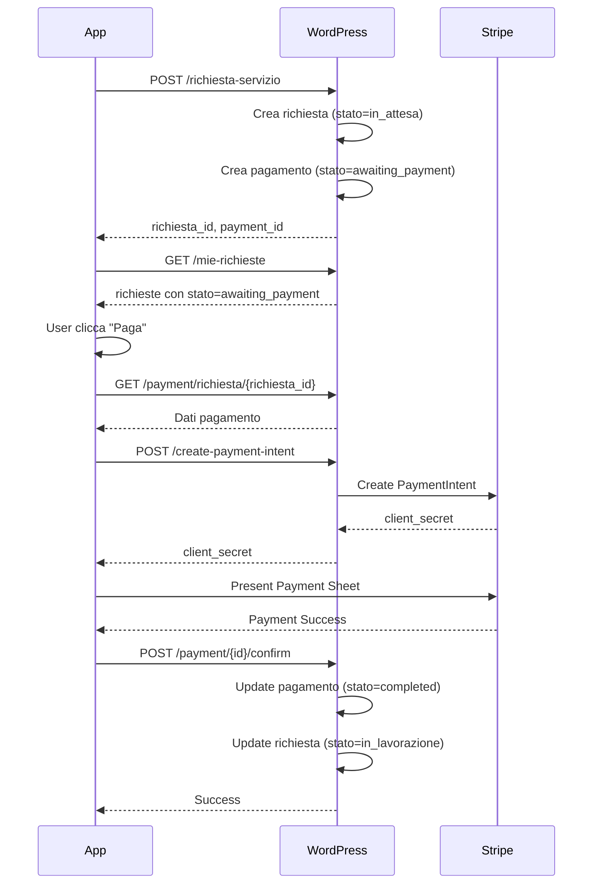

# 🔌 WeCoop - Backend API Pagamenti - Guida Implementazione

## 📊 Overview

Questa guida spiega come implementare gli endpoint API per la gestione dei pagamenti nell'app WeCoop.

---

## 🗄️ 1. Creazione Tabella Database

```sql
CREATE TABLE wp_wecoop_pagamenti (
  id BIGINT UNSIGNED AUTO_INCREMENT PRIMARY KEY,
  richiesta_id BIGINT UNSIGNED NOT NULL,
  user_id BIGINT UNSIGNED NOT NULL,
  importo DECIMAL(10,2) NOT NULL,
  stato VARCHAR(50) NOT NULL DEFAULT 'pending',
  metodo_pagamento VARCHAR(50),
  transaction_id VARCHAR(255),
  note TEXT,
  created_at DATETIME DEFAULT CURRENT_TIMESTAMP,
  updated_at DATETIME DEFAULT CURRENT_TIMESTAMP ON UPDATE CURRENT_TIMESTAMP,
  paid_at DATETIME,
  
  INDEX idx_richiesta_id (richiesta_id),
  INDEX idx_user_id (user_id),
  INDEX idx_stato (stato),
  
  FOREIGN KEY (richiesta_id) REFERENCES wp_wecoop_richieste_servizi(id) ON DELETE CASCADE,
  FOREIGN KEY (user_id) REFERENCES wp_users(ID) ON DELETE CASCADE
) ENGINE=InnoDB DEFAULT CHARSET=utf8mb4 COLLATE=utf8mb4_unicode_ci;
```

**Stati Pagamento Supportati:**
- `pending` - In attesa di pagamento
- `awaiting_payment` - Pagamento richiesto (mostra bottone "Paga" nell'app)
- `completed` - Pagamento completato (da app)
- `paid` - Pagato e verificato dal backend
- `failed` - Pagamento fallito
- `cancelled` - Annullato

---

## 🔗 2. Endpoint API da Implementare

### GET /payment/{id}

**Descrizione:** Ottiene i dettagli di un pagamento

**File:** `wp-content/plugins/wecoop-api/endpoints/pagamenti.php`

```php
<?php
// GET /wecoop/v1/payment/{id}
add_action('rest_api_init', function() {
    register_rest_route('wecoop/v1', '/payment/(?P<id>\d+)', [
        'methods' => 'GET',
        'callback' => 'wecoop_get_pagamento',
        'permission_callback' => 'is_user_logged_in',
        'args' => [
            'id' => [
                'required' => true,
                'type' => 'integer',
            ],
        ],
    ]);
});

function wecoop_get_pagamento($request) {
    global $wpdb;
    
    $payment_id = $request['id'];
    $user_id = get_current_user_id();
    
    // Query pagamento
    $pagamento = $wpdb->get_row($wpdb->prepare(
        "SELECT p.*, r.servizio, r.numero_pratica
         FROM {$wpdb->prefix}wecoop_pagamenti p
         LEFT JOIN {$wpdb->prefix}wecoop_richieste_servizi r ON p.richiesta_id = r.id
         WHERE p.id = %d",
        $payment_id
    ), ARRAY_A);
    
    if (!$pagamento) {
        return new WP_Error('not_found', 'Pagamento non trovato', ['status' => 404]);
    }
    
    // Verifica permessi: solo il proprietario può vedere
    if ($pagamento['user_id'] != $user_id && !current_user_can('manage_options')) {
        return new WP_Error('forbidden', 'Non hai i permessi', ['status' => 403]);
    }
    
    // Formatta response
    return new WP_REST_Response([
        'id' => (int)$pagamento['id'],
        'richiesta_id' => (int)$pagamento['richiesta_id'],
        'user_id' => (int)$pagamento['user_id'],
        'importo' => (float)$pagamento['importo'],
        'stato' => $pagamento['stato'],
        'metodo_pagamento' => $pagamento['metodo_pagamento'],
        'transaction_id' => $pagamento['transaction_id'],
        'note' => $pagamento['note'],
        'servizio' => $pagamento['servizio'],
        'numero_pratica' => $pagamento['numero_pratica'],
        'created_at' => $pagamento['created_at'],
        'updated_at' => $pagamento['updated_at'],
        'paid_at' => $pagamento['paid_at'],
    ], 200);
}
```

---

### GET /payments/user/{user_id}

**Descrizione:** Ottiene tutti i pagamenti di un utente

```php
// GET /wecoop/v1/payments/user/{user_id}
add_action('rest_api_init', function() {
    register_rest_route('wecoop/v1', '/payments/user/(?P<user_id>\d+)', [
        'methods' => 'GET',
        'callback' => 'wecoop_get_pagamenti_utente',
        'permission_callback' => 'is_user_logged_in',
    ]);
});

function wecoop_get_pagamenti_utente($request) {
    global $wpdb;
    
    $user_id = $request['user_id'];
    $current_user_id = get_current_user_id();
    
    // Solo l'utente stesso o admin
    if ($user_id != $current_user_id && !current_user_can('manage_options')) {
        return new WP_Error('forbidden', 'Non autorizzato', ['status' => 403]);
    }
    
    $pagamenti = $wpdb->get_results($wpdb->prepare(
        "SELECT p.*, r.servizio, r.numero_pratica
         FROM {$wpdb->prefix}wecoop_pagamenti p
         LEFT JOIN {$wpdb->prefix}wecoop_richieste_servizi r ON p.richiesta_id = r.id
         WHERE p.user_id = %d
         ORDER BY p.created_at DESC",
        $user_id
    ), ARRAY_A);
    
    $formatted = array_map(function($p) {
        return [
            'id' => (int)$p['id'],
            'richiesta_id' => (int)$p['richiesta_id'],
            'user_id' => (int)$p['user_id'],
            'importo' => (float)$p['importo'],
            'stato' => $p['stato'],
            'metodo_pagamento' => $p['metodo_pagamento'],
            'transaction_id' => $p['transaction_id'],
            'servizio' => $p['servizio'],
            'numero_pratica' => $p['numero_pratica'],
            'created_at' => $p['created_at'],
            'paid_at' => $p['paid_at'],
        ];
    }, $pagamenti);
    
    return new WP_REST_Response($formatted, 200);
}
```

---

### GET /payment/richiesta/{richiesta_id}

**Descrizione:** Ottiene il pagamento associato a una richiesta

```php
// GET /wecoop/v1/payment/richiesta/{richiesta_id}
add_action('rest_api_init', function() {
    register_rest_route('wecoop/v1', '/payment/richiesta/(?P<richiesta_id>\d+)', [
        'methods' => 'GET',
        'callback' => 'wecoop_get_pagamento_per_richiesta',
        'permission_callback' => 'is_user_logged_in',
    ]);
});

function wecoop_get_pagamento_per_richiesta($request) {
    global $wpdb;
    
    $richiesta_id = $request['richiesta_id'];
    $user_id = get_current_user_id();
    
    // Verifica che la richiesta appartenga all'utente
    $richiesta = $wpdb->get_row($wpdb->prepare(
        "SELECT user_id FROM {$wpdb->prefix}wecoop_richieste_servizi WHERE id = %d",
        $richiesta_id
    ));
    
    if (!$richiesta) {
        return new WP_Error('not_found', 'Richiesta non trovata', ['status' => 404]);
    }
    
    if ($richiesta->user_id != $user_id && !current_user_can('manage_options')) {
        return new WP_Error('forbidden', 'Non autorizzato', ['status' => 403]);
    }
    
    // Cerca pagamento
    $pagamento = $wpdb->get_row($wpdb->prepare(
        "SELECT p.*, r.servizio, r.numero_pratica
         FROM {$wpdb->prefix}wecoop_pagamenti p
         LEFT JOIN {$wpdb->prefix}wecoop_richieste_servizi r ON p.richiesta_id = r.id
         WHERE p.richiesta_id = %d",
        $richiesta_id
    ), ARRAY_A);
    
    if (!$pagamento) {
        return new WP_Error('not_found', 'Nessun pagamento trovato', ['status' => 404]);
    }
    
    return new WP_REST_Response([
        'id' => (int)$pagamento['id'],
        'richiesta_id' => (int)$pagamento['richiesta_id'],
        'user_id' => (int)$pagamento['user_id'],
        'importo' => (float)$pagamento['importo'],
        'stato' => $pagamento['stato'],
        'metodo_pagamento' => $pagamento['metodo_pagamento'],
        'transaction_id' => $pagamento['transaction_id'],
        'servizio' => $pagamento['servizio'],
        'numero_pratica' => $pagamento['numero_pratica'],
        'created_at' => $pagamento['created_at'],
        'paid_at' => $pagamento['paid_at'],
    ], 200);
}
```

---

### POST /payment/{id}/confirm

**Descrizione:** Conferma un pagamento dopo il successo da Stripe/PayPal

```php
// POST /wecoop/v1/payment/{id}/confirm
add_action('rest_api_init', function() {
    register_rest_route('wecoop/v1', '/payment/(?P<id>\d+)/confirm', [
        'methods' => 'POST',
        'callback' => 'wecoop_conferma_pagamento',
        'permission_callback' => 'is_user_logged_in',
    ]);
});

function wecoop_conferma_pagamento($request) {
    global $wpdb;
    
    $payment_id = $request['id'];
    $user_id = get_current_user_id();
    
    // Valida input
    $body = $request->get_json_params();
    $metodo_pagamento = sanitize_text_field($body['metodo_pagamento'] ?? '');
    $transaction_id = sanitize_text_field($body['transaction_id'] ?? '');
    $note = sanitize_textarea_field($body['note'] ?? '');
    
    if (empty($metodo_pagamento) || empty($transaction_id)) {
        return new WP_Error('bad_request', 'Parametri mancanti', ['status' => 400]);
    }
    
    // Verifica pagamento esiste e appartiene all'utente
    $pagamento = $wpdb->get_row($wpdb->prepare(
        "SELECT * FROM {$wpdb->prefix}wecoop_pagamenti WHERE id = %d",
        $payment_id
    ));
    
    if (!$pagamento) {
        return new WP_Error('not_found', 'Pagamento non trovato', ['status' => 404]);
    }
    
    if ($pagamento->user_id != $user_id && !current_user_can('manage_options')) {
        return new WP_Error('forbidden', 'Non autorizzato', ['status' => 403]);
    }
    
    // Aggiorna pagamento
    $updated = $wpdb->update(
        "{$wpdb->prefix}wecoop_pagamenti",
        [
            'stato' => 'completed',
            'metodo_pagamento' => $metodo_pagamento,
            'transaction_id' => $transaction_id,
            'note' => $note,
            'paid_at' => current_time('mysql'),
        ],
        ['id' => $payment_id],
        ['%s', '%s', '%s', '%s', '%s'],
        ['%d']
    );
    
    if ($updated === false) {
        return new WP_Error('server_error', 'Errore durante aggiornamento', ['status' => 500]);
    }
    
    // Aggiorna stato richiesta associata
    $wpdb->update(
        "{$wpdb->prefix}wecoop_richieste_servizi",
        ['stato' => 'in_lavorazione'], // Passa da awaiting_payment a in_lavorazione
        ['id' => $pagamento->richiesta_id]
    );
    
    // Invia email conferma (opzionale)
    $user = get_userdata($pagamento->user_id);
    wp_mail(
        $user->user_email,
        'Pagamento Confermato - WeCoop',
        "Il tuo pagamento di €{$pagamento->importo} è stato confermato.\n\nMetodo: {$metodo_pagamento}\nID Transazione: {$transaction_id}"
    );
    
    return new WP_REST_Response([
        'success' => true,
        'message' => 'Pagamento confermato con successo',
    ], 200);
}
```

---

### POST /create-payment-intent (Stripe)

**Descrizione:** Crea un Payment Intent per Stripe

**Requisiti:**
```bash
composer require stripe/stripe-php
```

```php
// POST /wecoop/v1/create-payment-intent
add_action('rest_api_init', function() {
    register_rest_route('wecoop/v1', '/create-payment-intent', [
        'methods' => 'POST',
        'callback' => 'wecoop_crea_stripe_payment_intent',
        'permission_callback' => 'is_user_logged_in',
    ]);
});

function wecoop_crea_stripe_payment_intent($request) {
    require_once WP_CONTENT_DIR . '/vendor/autoload.php';
    
    // Configura Stripe (usa chiavi da wp-config.php)
    \Stripe\Stripe::setApiKey(STRIPE_SECRET_KEY);
    
    $body = $request->get_json_params();
    $amount = (int)($body['amount'] ?? 0);
    $currency = sanitize_text_field($body['currency'] ?? 'eur');
    $payment_id = (int)($body['payment_id'] ?? 0);
    
    if ($amount <= 0) {
        return new WP_Error('bad_request', 'Importo non valido', ['status' => 400]);
    }
    
    try {
        $paymentIntent = \Stripe\PaymentIntent::create([
            'amount' => $amount,
            'currency' => $currency,
            'metadata' => [
                'payment_id' => $payment_id,
                'user_id' => get_current_user_id(),
            ],
            'automatic_payment_methods' => [
                'enabled' => true,
            ],
        ]);
        
        return new WP_REST_Response([
            'clientSecret' => $paymentIntent->client_secret,
        ], 200);
        
    } catch (\Stripe\Exception\ApiErrorException $e) {
        return new WP_Error('stripe_error', $e->getMessage(), ['status' => 500]);
    }
}
```

**Aggiungi a wp-config.php:**
```php
define('STRIPE_PUBLIC_KEY', 'pk_live_...');
define('STRIPE_SECRET_KEY', 'sk_live_...');
```

---

## 🔄 3. Aggiornamento Endpoint Richieste

Modifica `GET /mie-richieste` per includere info pagamento:

```php
function wecoop_get_mie_richieste($request) {
    global $wpdb;
    
    // ... codice esistente ...
    
    $richieste = $wpdb->get_results($wpdb->prepare(
        "SELECT r.*, 
                p.id as payment_id,
                p.importo,
                p.stato as payment_stato
         FROM {$wpdb->prefix}wecoop_richieste_servizi r
         LEFT JOIN {$wpdb->prefix}wecoop_pagamenti p ON r.id = p.richiesta_id
         WHERE r.user_id = %d
         ORDER BY r.created_at DESC",
        $user_id
    ), ARRAY_A);
    
    $formatted = array_map(function($r) {
        return [
            'id' => (int)$r['id'],
            'servizio' => $r['servizio'],
            'categoria' => $r['categoria'],
            'stato' => $r['stato'],
            'numero_pratica' => $r['numero_pratica'],
            'data_richiesta' => $r['created_at'],
            
            // Info pagamento
            'payment_id' => $r['payment_id'] ? (int)$r['payment_id'] : null,
            'importo' => $r['importo'] ? (float)$r['importo'] : null,
            'payment_stato' => $r['payment_stato'],
            
            // App logic
            'puo_pagare' => $r['stato'] === 'awaiting_payment',
        ];
    }, $richieste);
    
    return new WP_REST_Response(['success' => true, 'richieste' => $formatted], 200);
}
```

---

## 🧪 4. Testing

### Test con cURL

```bash
# 1. Get pagamento
curl -X GET "https://wecoop.org/wp-json/wecoop/v1/payment/123" \
  -H "Authorization: Bearer YOUR_JWT_TOKEN"

# 2. Get pagamenti utente
curl -X GET "https://wecoop.org/wp-json/wecoop/v1/payments/user/42" \
  -H "Authorization: Bearer YOUR_JWT_TOKEN"

# 3. Conferma pagamento
curl -X POST "https://wecoop.org/wp-json/wecoop/v1/payment/123/confirm" \
  -H "Authorization: Bearer YOUR_JWT_TOKEN" \
  -H "Content-Type: application/json" \
  -d '{
    "metodo_pagamento": "stripe",
    "transaction_id": "pi_3ABC123xyz",
    "note": "Pagato con Stripe"
  }'

# 4. Crea Payment Intent
curl -X POST "https://wecoop.org/wp-json/wecoop/v1/create-payment-intent" \
  -H "Authorization: Bearer YOUR_JWT_TOKEN" \
  -H "Content-Type: application/json" \
  -d '{
    "amount": 5000,
    "currency": "eur",
    "payment_id": 123
  }'
```

---

## 📋 5. Workflow Completo



---

## ✅ Checklist Implementazione

### Backend
- [ ] Creare tabella `wp_wecoop_pagamenti`
- [ ] Implementare GET `/payment/{id}`
- [ ] Implementare GET `/payments/user/{user_id}`
- [ ] Implementare GET `/payment/richiesta/{richiesta_id}`
- [ ] Implementare POST `/payment/{id}/confirm`
- [ ] Implementare POST `/create-payment-intent` (Stripe)
- [ ] Aggiornare GET `/mie-richieste` con info pagamenti
- [ ] Modificare POST `/richiesta-servizio` per creare pagamento quando necessario
- [ ] Configurare chiavi Stripe in wp-config.php
- [ ] Testare tutti gli endpoint

### Dashboard Admin
- [ ] Creare pagina "Gestione Pagamenti"
- [ ] Lista pagamenti con filtri (stato, data, utente)
- [ ] Dettaglio pagamento con cronologia
- [ ] Azione manuale "Marca come pagato"
- [ ] Esporta report pagamenti CSV

---

**Data:** 26 Dicembre 2025  
**Versione:** 1.0.0  
**Compatibilità:** WordPress 5.0+, PHP 7.4+
